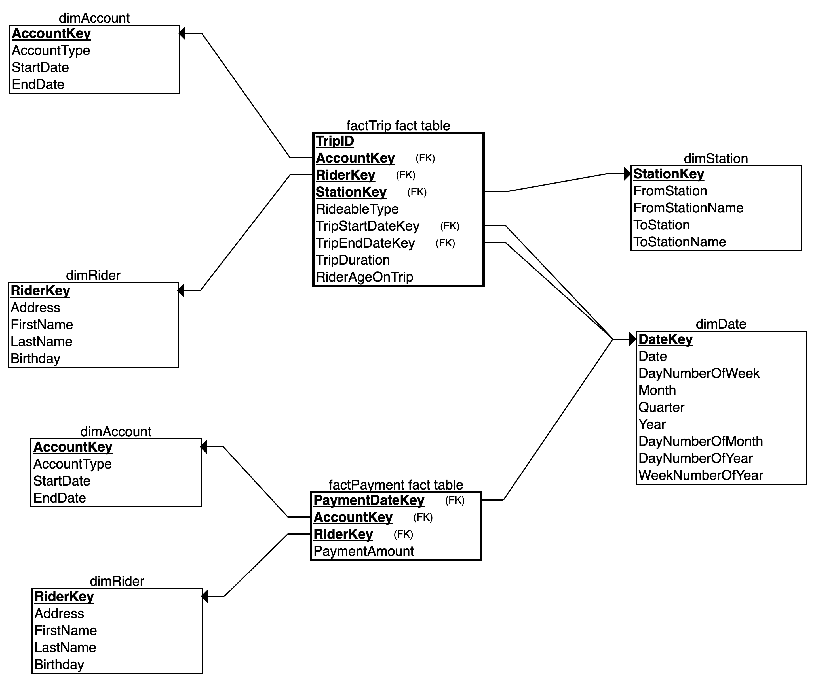

# Azure DWH - Divvy Bike share

Divvy is a bike sharing program in Chicago, Illinois USA that allows riders to purchase a pass at a kiosk or use a mobile application to unlock a bike at stations around the city and use the bike for a specified amount of time.

## Getting Started

The goal of this project is to develop a data warehouse solution using Azure Synapse Analytics. You will:

- Design a star schema based on the business outcomes listed below.
- Import the data into Synapse.
- Transform the data into the star schema.
- View the reports from Analytics.

### Business Outcomes
1. Analyze how much time is spent per ride
   - Based on date and time factors such as day of week and time of day
   - Based on which station is the starting and / or ending station
   - Based on age of the rider at time of the ride
   - Based on whether the rider is a member or a casual rider
2. Analyze how much money is spent
   - Per month, quarter, year
   - Per member, based on the age of the rider at account start
3. EXTRA CREDIT - Analyze how much money is spent per member
   - Based on how many rides the rider averages per month
   - Based on how many minutes the rider spends on a bike per month

### Dependencies

- [Python](https://www.python.org/downloads/)
- [Visual Studio Code](https://code.visualstudio.com/)
- Install Python dependencies:
   ```
   pip install -r requirements.txt
   ```
- [Divvy dataset](https://video.udacity-data.com/topher/2022/March/622a5fc6_azure-data-warehouse-projectdatafiles/azure-data-warehouse-projectdatafiles.zip)

### Installation

After installing dependencies, you need to download Divvy dataset and move it into `src/data` directory.

## Project Instructions

Creating resources on Azure cloud provider.
Project instructions can be found [here](./INSTRUCTIONS.md)

**Note:** After creating Azure PostgreSQL Server [etl.py](./src/etl.py) script is executed with configured [dwh.cfg](./src/dwh.cfg)

### ERD Diagram
Since the data from Divvy are anonymous, we have created fake rider and account profiles along with fake payment data to go along with the data from Divvy. The dataset looks like this:


### Star Schema
Star Schema is designed based on the relational diagram and the business problems outlined. ([PDF Version](./resources/divvy-star-schema.pdf))



### Synapse Dedicated SQL Pool


### Azure Blob Storage


